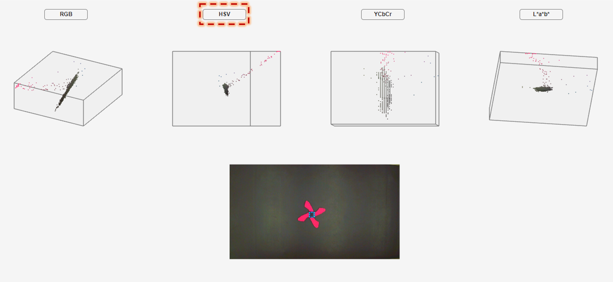
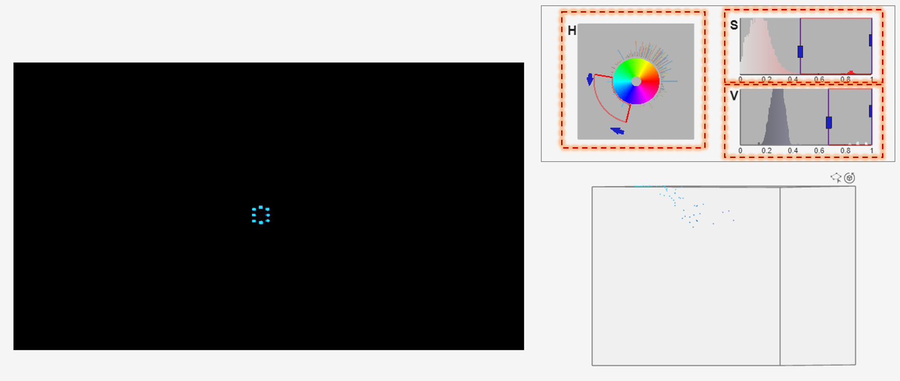
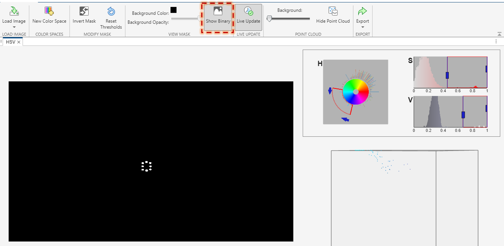

# Vision Tracking

This readme helps in navigating through the paper where more in depth details are needed to setup the tracking framework. In this, we will go through the following:

1) Initial camera setup: Adjusting the camera properties for tracking using MATLAB ToolBox
2) Generating Chromatic Mask: In MATLAB how do we use the Toolbox to create a color mask. Here we use HSV color space.
3) Parallel Processing: Initializing parallel processing using MATLAB ToolBox

## A. Initial camera setup (See Section III-A)

These colored markers are usually not vibrant as they could be when seeing through the camera. This is due to heavy enviroment lighting which over exposures the marker. For this reason, the markers look more whitewashed. However, by strategically adjusting the camera settings, the markers can be vibrantly dominated in the scene while the environment is dulled. To do this, we use MATLAB Color Thresholder App. This app is a part of the MATLAB's **Image Processing Toolbox**.

<ins>Step 1</ins>: On the ***Apps*** tab, under the ***Image Processing and Computer Vision*** section, select the ***Color Thresholder*** icon. 

Now the **Color Thresholder** application will be open, then

<ins>Step 2</ins>: Select ***Load Image***, then choose ***Acquire Image From Camera***.

Now a live preview from the camera can be seen along with ***Camera Properties*** option.

<ins>Step 3</ins>: Click on ***Camera Properties***, now it will show a UI Slider with adjustable properties like *Resolution, BacklightCompensation, Brightness, Contrast, ExposureMode, Exposure, Gain, Gamma etc.*

<ins>Step 4</ins>: Then choose the *Resolution* in which you want to capture video stream. This is a very important step and has to be done first before altering any other properties. Changing the *Resolution* after changing other properties will result in unexpected results as the value of the properties are dependent on the set *Resolution*.

<ins>Step 5</ins>: Now adjust the other properties. Generally, leaving all other properties to its default value, and adjusting only *BacklightCompensation* and *Saturation* will yield expected result. On the slider, slide the *BacklightCompensation* to its lowest value and *Saturation* to its maximum value (anywhere between 90-100). 

The markers should be vibrantly visible now dominating the environment. If you are not happy, adjust other properties until you are satisfied.

<ins>Step 6</ins>: Record the values of all the properties. 

<ins>Step 7</ins>: Finally, use these values to setup the camera properties while initializing the camera for capturing the video stream.

## B. Generating Chromatic Mask (See Section III-B)

From the captured video, a frame is extracted for creating the chromatic mask. 

<ins>Step 1</ins>: Open the video in MATLAB and extract a frame. To extract the 1st frame from the captured video,

vread = VideoReader('Your video file name');
frame_read = read(vread,1);

<ins>Step 2</ins>: On the ***Apps*** tab, under the ***Image Processing and Computer Vision*** section, select the ***Color Thresholder*** icon.

Now the **Color Thresholder** application will be open, then

<ins>Step 3</ins>: Select ***Load Image***, then choose ***Load Image From Workspace***.

In the dialog Box choose the image *frame_read*

<ins>Step 4</ins>: From the color space options, choose ***HSV*** color space.

<ins>Step 5</ins>: Adjust the sliders of H (Hue), S (Saturation), V (Value) values to segment only the marker color. Start with adjusting H (Hue) first.

<ins>Step 6</ins>: Once the sliders are adjusted properly, only the chromatic signatures of marker can be seen. 

For better visual verification, choose ***Show Binary*** option.

<ins>Step 7</ins>: Finally, select ***Export*** and choose ***Export Function***.

## C. Parallel Processing (See Section IV-B)

Parallel processing is utilized when implementing Online Tracking (See Section IV-B) framework. To initiate multi-threading,

<ins>Step 1</ins>: If not installed, download and install ***MATLAB Parallel Processing Toolbox***

<ins>Step 2</ins>: Navigate to the bottom left corner in MATLAB, and click on this **icon**

